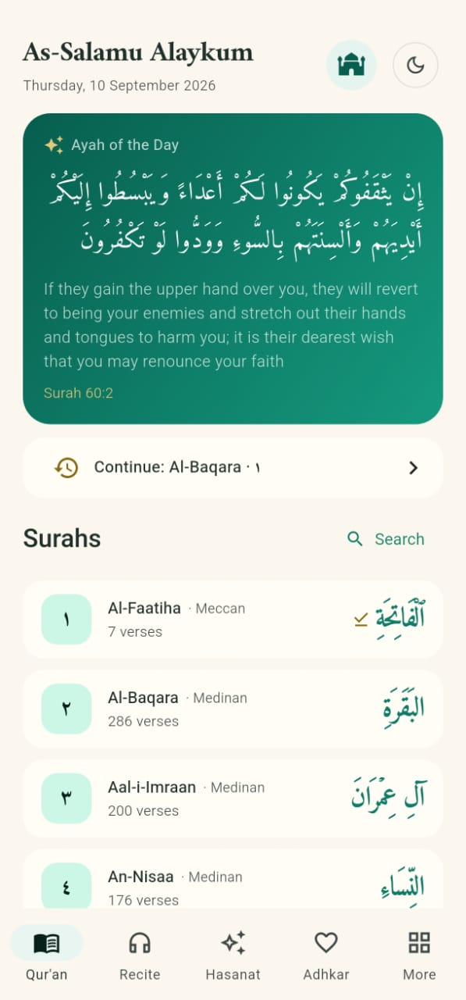
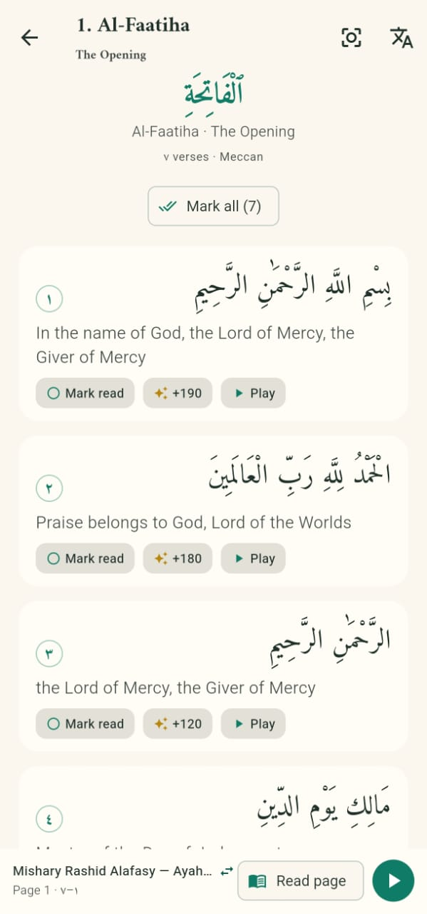
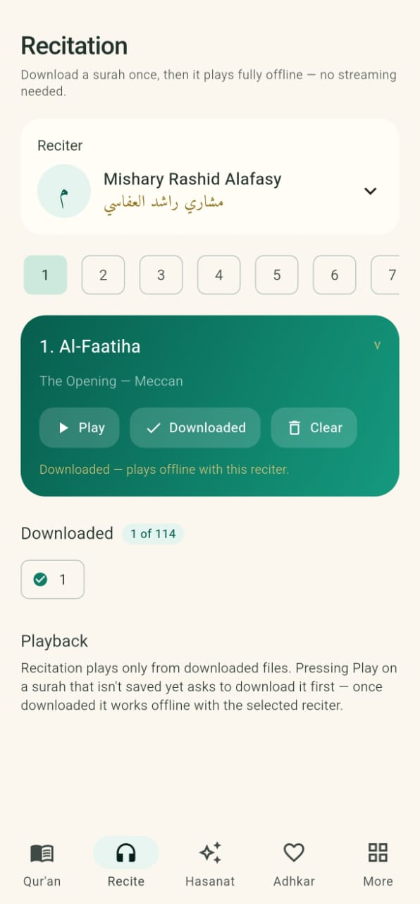
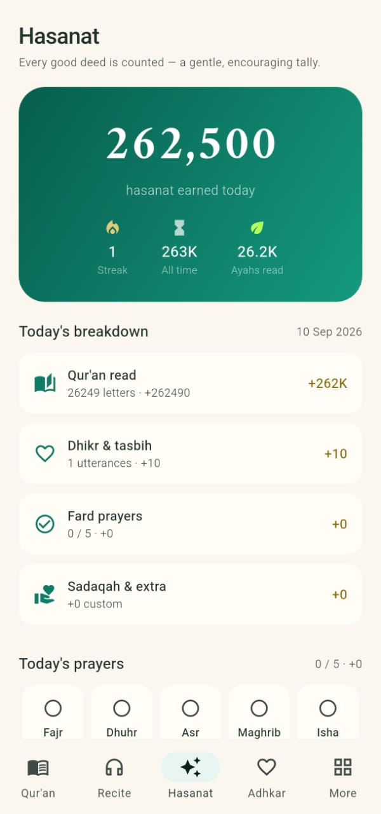
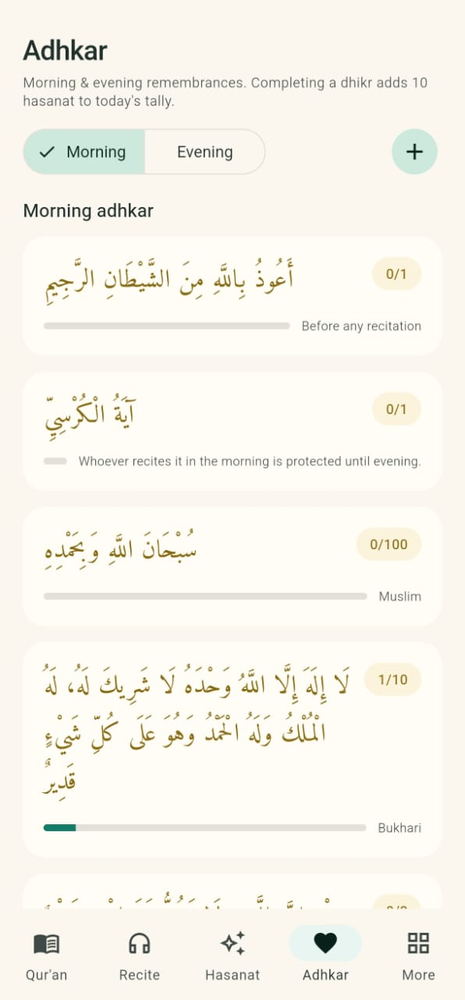
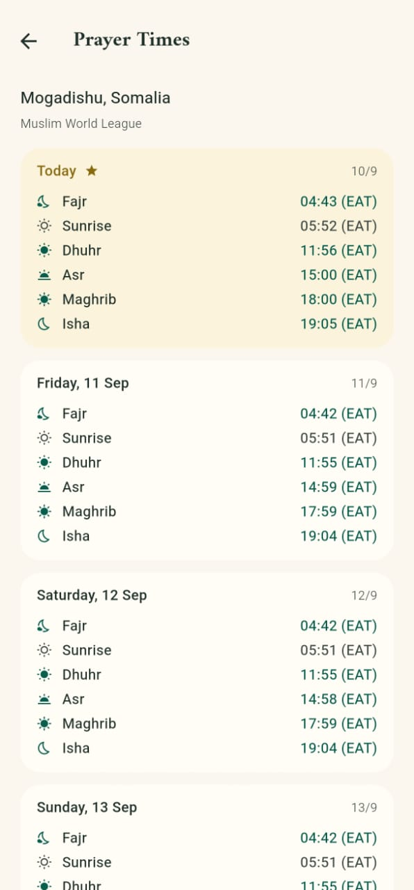
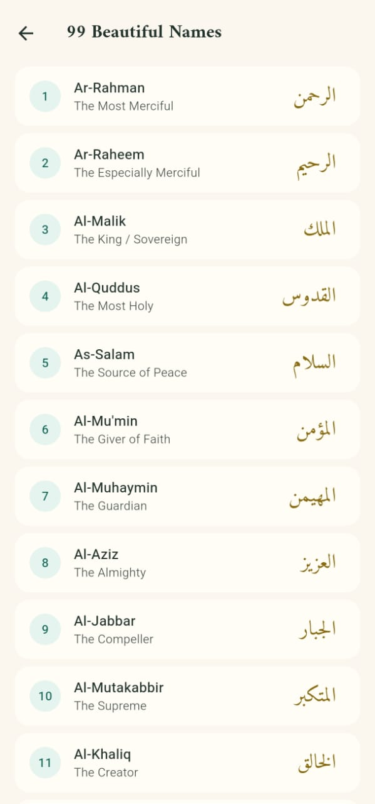
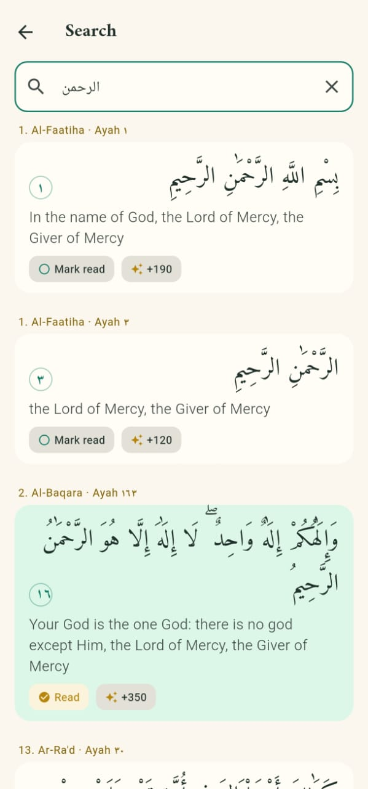
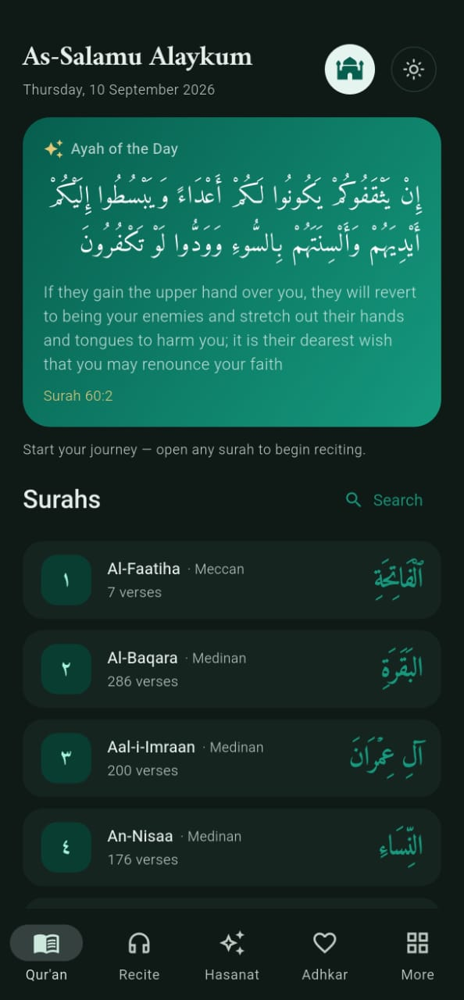

# Noor — نُور (Light)

A serene, offline-first Qur'an companion for Android with recitation,
hasanat (good-deed) tracking, morning & evening adhkar, the 99 Names of
Allah, and prayer times.

Made with a sincere intention — see the [dedication](#dedication) below —
in a beautiful emerald-and-gold style that stays gentle on the eyes in both
light and dark mode.

---

## Screenshots

> Screenshots pending — drop your captures into `docs/screenshots/` and add
> them to the table below so the images render on GitHub.

| Onboarding / Home | Qur'an Reader | Recitation |
|:-----------------:|:-------------:|:----------:|
|  |  |  |

| Hasanat | Adhkar | Prayer Times |
|:-------:|:------:|:------------:|
|  |  |  |

| 99 Names | Search | Dark mode |
|:--------:|:------:|:---------:|
|  |  |  |

---

## Features

- **Read the Qur'an (Uthmani script)** — all 114 surahs with an optional
  English translation (M.A.S. Abdel Haleem), word-by-word clean layout.
- **Bookmarks that remember** — every surah keeps its own exact position.
  Reopen a surah and choose *Continue from where you left* or *Read from
  the start*; the home screen always shows one tap away where you stopped.
- **Recitation & offline listening** — pick from curated reciters (Alafasy,
  Al-Ajmi, Al-Husary, Al-Minshawi, As-Sudais, and more), download a surah
  once, and play it fully offline; tap any ayah to play from that point.
- **Hasanat tally** — reading letters, dhikr, prayers, and {custom} good
  deeds all feed an encouraging daily counter, with honest disclosure about
  how the numbers relate to real reward.
- **Morning & evening adhkar** — authentic remembrances with repeat counters
  and progress bars, plus *add your own dhikr* with a repeat goal.
- **Prayer times** — Fajr through Isha for your city, quickly reachable
  from home or the More tab.
- **The 99 Beautiful Names of Allah** — memorise, count, and reflect.
- **First-run coach marks** — a gentle tutorial spotlights the core actions
  on each screen the first time you visit.
- **Offline-first** — the entire Qur'an text ships with the app; only audio
  and prayer-time lookups need the internet.

---

## Dedication

This app is made as **Sadaqah Jariyah** — an ongoing charity whose reward
continues after us, by the will of Allah.

It is dedicated to:

> My family, my beloved ones, my friends, my acquaintances, my grandparents —
> both those alive and those who have passed away — and all Muslims, living
> and those who have passed away, and every person who makes use of this app.
>
> أُهديه إلى عائلتي وأحبابي وأصدقائي ومعارفي، وإلى أجدادي أحياءً وأمواتًا،
> وإلى جميع المسلمين أحياءً وأمواتًا، وإلى كل من يستفيد من هذا العمل
>
> اللهم تقبلها واجعلها خالصة لوجهك الكريم، واجعلها في ميزان حسنات كل من
> ساهم فيها واستفاد منها

### An honest note

Allah is always far more generous than any counter can show. The hasanat
tally is only a gentle encouragement, built to match Islamic teachings as
faithfully as possible. Whatever was done right, every credit belongs to
Allah; for any shortcoming, the developer seeks Allah's forgiveness, and
asks Allah to accept this work and have mercy on everyone who helped or
benefits from it.

---

## Play Store

The app is currently being prepared for Google Play. Once published, the
"Share Noor" tile inside the app will open the listing directly.

**To add your Play Store link:** set `kPlayStoreUrl` in
`lib/data/static_content.dart` to your store URL, e.g.

```dart
const String kPlayStoreUrl =
    'https://play.google.com/store/apps/details?id=com.muraap.noor';
```

The app's published application id is **`com.muraap.noor`** (set in
`android/app/build.gradle.kts`). Keep this id identical in your Play
Console listing — it cannot change after the first release.

---

## Tech stack

- **Flutter** (Dart) — single codebase, Material 3
- **Provider** — state management
- **audio_service + audioplayers** — background, notification-shade audio
- **flutter_local_notifications** — daily dhikr reminder
- **flutter_native_splash & flutter_launcher_icons** — branded splash + icon
- **SharedPreferences** — local persistence

## Data & credits

- Qur'an text: [quran-api](https://github.com/fawazahmed0/quran-api)
  (Uthmani script)
- English translation: M.A.S. Abdel Haleem, Oxford University Press
- Audio: [Islamic Network CDN](https://cdn.islamic.network/)
  (cdn.islamic.network)
- Prayer times: [Aladhan API](https://aladhan.com/prayer-times-api)
- Mushaf page mapping: Madani 15-line pagination

---

## Building

```bash
flutter pub get
flutter analyze
flutter test

# Debug APK
flutter build apk --debug

# Release App Bundle (for Google Play)
flutter build appbundle --release
```

> Before your first Play release, configure a real signing key in
> `android/app/build.gradle.kts` (the current release build signs with the
> debug key for development/testing only).

## Repository layout

```
lib/
  screens/        Quran, Recitation, Hasanat, Adhkar, More (+ settings)
  widgets/        Shared UI (ayah tile, tutorials, reciter picker, ...)
  providers/      State (quran, recitation, hasanat, settings, ...)
  data/           Bundled Qur'an JSON, adhkar, reciters, mushaf pages
  models/         Domain models
  theme/          Emerald & gold color scheme
assets/
  json/           Qur'an text bundles
  fonts/          Amiri font
  images/         Logo, splash, icons
docs/screenshots/ Placeholder — add your screenshots here
```